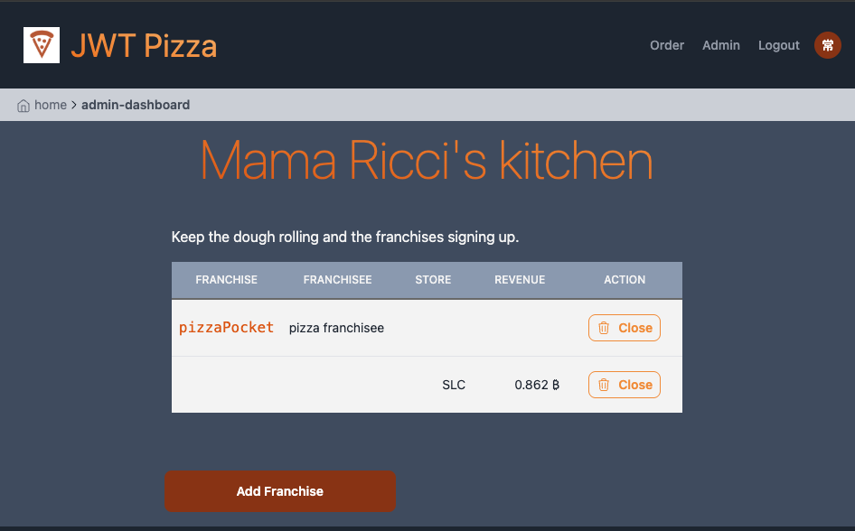
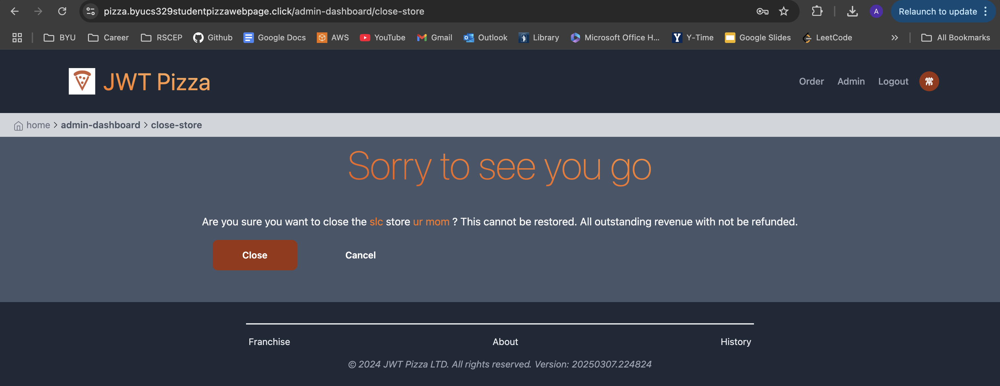
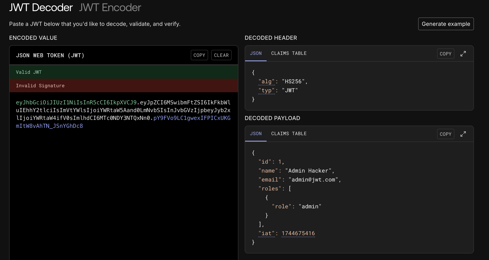

# Andy Mam and Kensey Thomason Penetration Tests

### Andy Self-Attack

| Item           | Result                                                                         |
| -------------- | ------------------------------------------------------------------------------ |
| Date           | April 11, 2025                                                                 |
| Target         | pizza.mampizza.click                                                       |
| Classification | Identification and Authentication Failures                                                                     |
| Severity       | 2                                                                              |
| Description    | Admin password was weak. Anyone could have guessed it and gained admin privileges.                |
| Images         |    Sensitive information exposed. |
| Corrections    | Change admin password.                                                          |

### Mackensey Self-Attack

| Item              | Result                                                                 |
|-------------------|------------------------------------------------------------------------|
| **Date**          | April 11, 2025                                                        |
| **Target**        | https://pizza.byucs329studentpizzawebpage.click/                      |
| **Classification**| Privilege Escalation                                                 |
| **Severity**      | 3                                                                |
| **Description**   | Attempted to upgraded regular user to admin and create franchise.     |
| **Images**        |                          A fake user created the "Ur Mom" franchise, which is non-functional and not serviceable to customers. |
| **Corrections**   | Sanitized inputs and enforced role-based access control.       |

# Peer Tests

### Andy Attack Kensey

| Item           | Result                                                                         |
| -------------- | ------------------------------------------------------------------------------ |
| Date           | April 14, 2025                                                                 |
| Target         | https://pizza.byucs329studentpizzawebpage.click/                                                       |
| Classification | Identification and Authentication Failures                                                                     |
| Severity       | 2                                                                              |
| Description    | Guessed her admin password lol.                |
| Images         |    I can delete stores. |
| Corrections    | Change admin password.                                                          |

## Mackensey Thomason attacking Andy Mam

| Item              | Result                                                                 |
|-------------------|------------------------------------------------------------------------|
| **Date**          | April 11, 2025                                                        |
| **Target**        | https://pizza.mampizza.click/                      |
| **Classification**| Broken Authentication / JWT Tampering Attempt                                                |
| **Severity**      | 0 (no breach occurred)                                                              |
| **Description**   | A forged JWT was generated to impersonate an admin by modifying the payload. While the token had a valid signature, the server correctly denied access because it checked user ID and roles in the backend database.|
| **Images**        |  used JWT.io to try and impersonate and admin.|
| **Corrections**   |No correction needed — backend properly validates identity server-side.|

## Combined Summary of Learnings
Throughout the process of conducting both self and peer penetration tests, we gained valuable insights into common vulnerabilities that can exist in web applications, especially those related to authentication and authorization.

- **Strong passwords matter:** One of the biggest lessons was how easily an attacker can gain admin access simply by guessing a weak password. This highlighted how important it is to enforce secure password policies (e.g., minimum length, complexity, and rate limiting).

- **Privilege escalation is real:** We learned that it’s not enough to hide admin functionality on the frontend. If the backend doesn’t enforce strict role-based access control, attackers can exploit this by modifying requests (e.g., using a forged JWT or changing user roles in requests) to gain elevated permissions.

- **JWT tokens can be tampered with:** By decoding and modifying JWT tokens (using tools like jwt.io), we tested if a backend blindly trusted what was inside the token. Even though our attack failed (because the backend correctly validated token identity and roles server-side), it showed how easily things could go wrong if validation was skipped.

- **SQL injection is a threat:** While we didn’t successfully execute an injection, our research showed how malicious input (like ' OR 1=1 --) could be used to manipulate or delete data if inputs aren’t sanitized properly.

These tests helped us better understand how attackers think and, more importantly, how we can build applications that are resilient, secure, and respectful of user trust.

